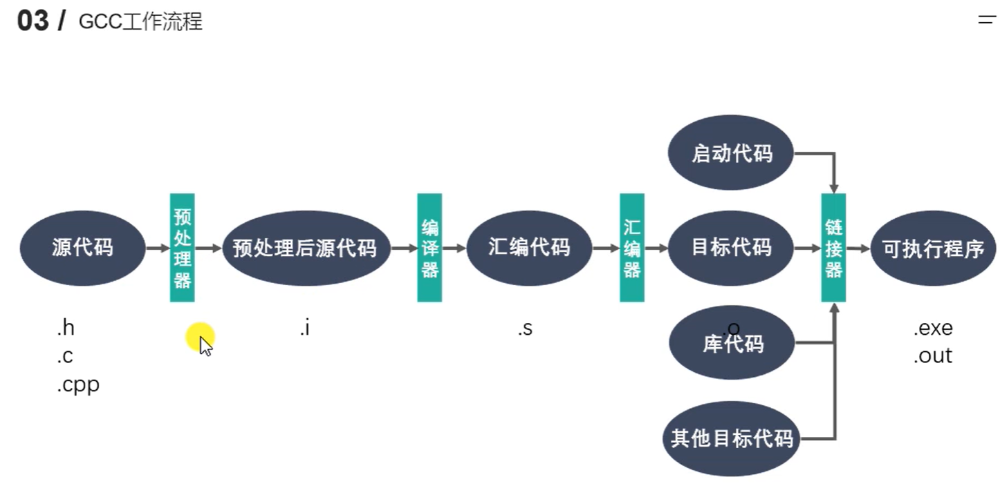

# nowcode_webserver
> 牛客网c++项目学习记录

# 入门

## GCC




## 静态库

> 在程序的**链接阶段**被复制到程序中
>
> 对比动态库：在程序**运行阶段**由系统动态加载到内存中供程序调用

*命名规则*

- Linux: libxxx.a
- Windows: libxxx.lib

*制作过程*

- gcc -- .o 文件
- gcc -c xx.cpp xx.cpp 
- 将 .o 文件打包

*使用*

```
g++ main.cpp -o app -L[静态库搜索路径] -l[静态库名称(无前后缀)]
```

## 动态库

